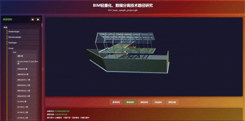

# GLTF Viewer with Three.js

A lightweight GLTF model viewer built with Three.js.

## 🌐 Code Repository

- **GitHub**: https://github.com/ViewSuSu/Su.ThreeJS.Demo
- **Gitee**: https://gitee.com/SususuChang/su.-three-js.-demo

## 🎬 Demo



## ✨ Features

- 🎯 **Model Loading** - Supports loading and displaying 3D models in GLTF/GLB format
- 🔄 **Interactive Operations** - Supports model rotation viewing
- 🎯 **Selection & Positioning** - Click to select models and auto-position
- 💡 **Highlight Display** - Highlight selected models
- ℹ️ **Information Panel** - Dockable information display interface
- 🌳 **Structure Tree** - Model hierarchy structure tree control
- 📦 **Lightweight Dependencies** - Minimal dependencies, focused on core functionality
- 🗂️ **Integrated Data & Model** - Unified storage of data and models

## 🚀 Quick Start

### Running the Project

Open the `index.html` file directly to run:

```bash
# Open directly in browser
Double-click index.html file
```

## 💡 Technical Features

### Integrated Data & Model Storage

Unlike most solutions in the market that export data as JSON and separate it from models, this project utilizes the characteristics of the GLTF file format. When saving as .glb files, it directly stores model-related data by adding data nodes. This approach avoids maintaining additional files and achieves unified management of data and models.

## 📁 Project Structure

```
Project Root/
├── .git/               # Git version control directory
├── models/             # Model files directory
│   └── basic_sample_project.glb  # Example GLB model file
├── index.html          # Main page file
├── README.md           # Project documentation
├── script.js           # JavaScript main program
└── style.css           # Style file
```

## 🛠 Technology Stack

- [Three.js](https://threejs.org/) - 3D graphics library
- GLTF/GLB format support
- Pure frontend implementation, no backend service required

## 🎮 User Guide

- **Left Mouse Drag**: Rotate camera
- **Mouse Wheel**: Zoom view
- **Click Model**: Select and highlight
- **Structure Tree Click**: Browse model components

## 🤝 Contribution

Welcome to submit Issues and Pull Requests!
